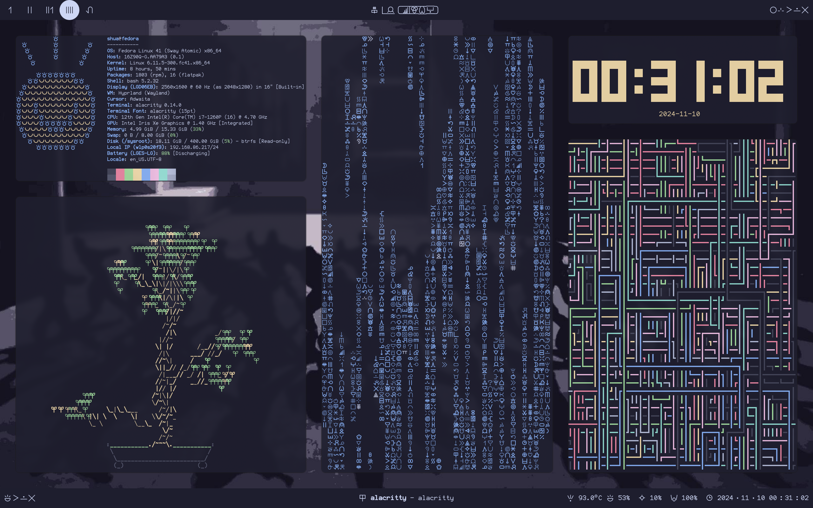
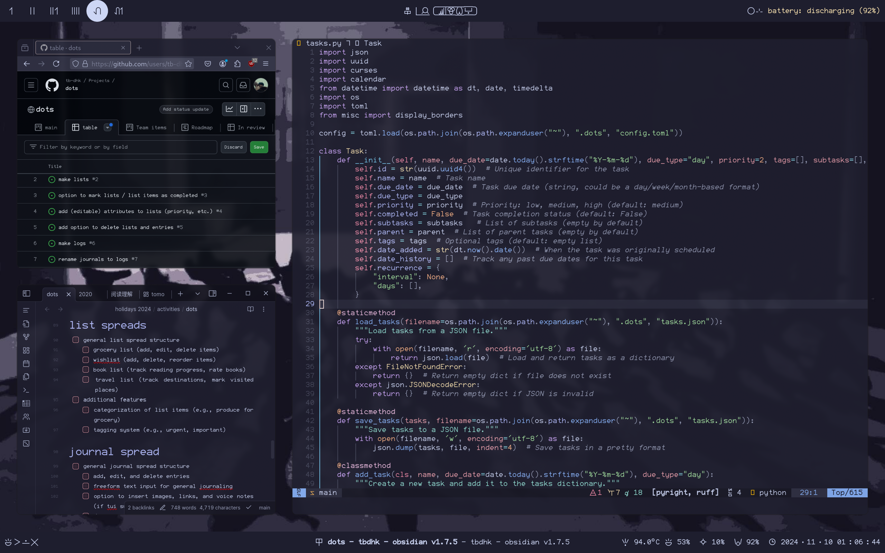

# shua's config files

this is a collection of my config files for various programs. these files are designed for swaywm and waybar on linux mint. these are my personal config files, so there is no guarantee that they will work on other systems.

this configuration is heavily inspired by the [constructed language](https://conlang.org) [toki pona](https://tokipona.org) and its logographic writing system, [sitelen pona](https://sona.pona.la/wiki/sitelen_pona).

i use linux mint and the colorscheme used here is [catppuccin](https://github.com/catppuccin/catppuccin).

## features
- swaywm
    - new workspaces
        - `mod` + `Ctrl` + number to switch to workspaces 11 to 20
        - `mod` + `Ctrl` + `Shift` + number to move the current window to workspaces 11 to 20
    - screenshotting
        - `Print` to take a screenshot of the entire screen (already in default config)
        - `mod` + `Print` to take a screenshot of the current window
        - `Shift` + `Print` to take a screenshot of the current workspace
        - add `Ctrl` to any of the above to save the screenshot to the clipboard
- waybar
    - top bar
        - workspace numbers in sitelen pona (up to 20)
        - "shua's computer" in sitelen pona
        - notifications
    - bottom bar
        - left
            - currently playing media
            - active steam games
        - center
            - currently focused window
        - right
            - cpu temperature
            - volume
            - backlight brightness
            - battery
            - date and time

### sample images



## configurations available for:
- swaywm
- waybar
- alacritty
- spicetify  
- obsidian (in the `.obsidian` directory)
- nvim (not shown)
- starship (not shown)

## requirements
- fairfax hd and fairfax pona hd (fonts)
- python 3.10

## credits
- the desktop background image comes from the [music video for girls never die by tripleS](https://www.youtube.com/watch?v=2tda_TCjz8w)
- the background image was edited using [catppuccin-factory](https://github.com/Fxzzi/catppuccin-factory)

## installation
```
# clone the repository
git clone https://github.com/tb-dhk/dotfiles

# copy the config files to the appropriate directories
cp -r dotfiles/.config/* ~/.config/
```

do also copy `dotfiles/.obsidian` to your obsidian vault directory.

## useful commands
```
# cbonsai 
cbonsai -L 50 -c "󱤗" # this is the glyph for "kasi"

# neofetch
neofetch --ascii ~/.config/neofetch/tokipona.txt --ascii_colors 4 3

# unimatrix
unimatrix -u "$(~/.config/scripts/sitelen-pona.sh)"

# tty-clock
tty-clock -s -c -C 3

# pipes.sh
pipes.sh -f 100 -r 0
```
